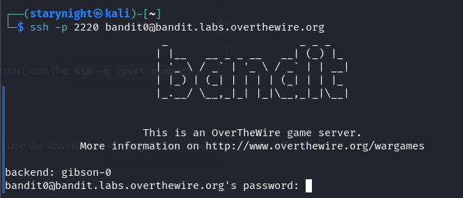
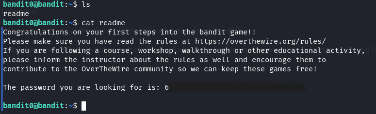
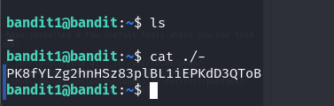
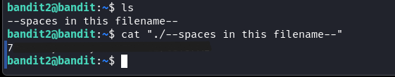
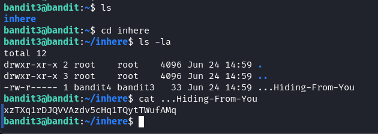
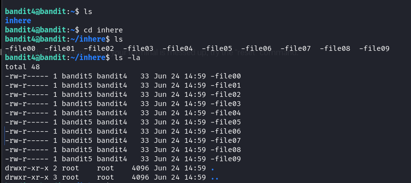
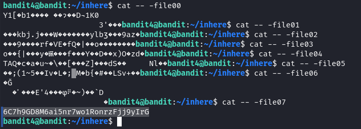
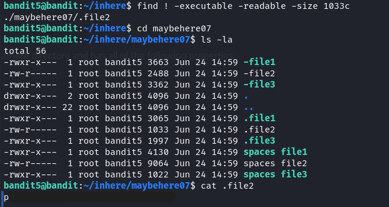

<h1>Bandit – Over the Wire Walkthrough</h1>
<h2>Level 1 to 5</h2>
All the Bandit levels works on SSH shells.
SSh is a network layer protocol which allows remote access of devices, manage servers and transfer files over an unsecured network. 
All the labs are based on ssh. We need to login in via ssh to solve all the levels. 
Each level has the password for the next level. 
Before accessing the next level, remember to logout from the current session using <code>exit</code> command.  

<code>Syntax: ssh -p {port_number} username@hostname</code>

Level 0:
In this challenge, I had to connect to <code>bandit.labs.overthewire.org</code> on port 2220 using ssh.  
Username: bandit0 
Password: bandit0 
 
Once I entered the password I was in.  

Level 0 -> Level 1 
The Level description said that the password for the next level was stored in <code>‘readme’</code>. 
So I listed all the files in the current directory using <code>ls</code> command and got the password using <code>cat</code> which is used to show the contents of a file. 
  

Level 1 -> Level 2 
This level says that the password is stored in -. It was located in the home directory so I listed all the contents of this directory using <code>ls</code>. 
On using the google search for dashed filename, I found that: 
“This type of approach has a lot of misunderstanding because using - as an argument refers to STDIN/STDOUT i.e dev/stdin or dev/stdout .So if you want to open this type of file you have to specify the full location of the file such as ./- .For eg. , if you want to see what is in that file use <code>cat ./-</code>“ 
So the command was: <code>cat ./-</code> 
  

Level 2 -> Level 3 
This level says: “The password for the next level is stored in a file called 
 <code>--spaces in this filename--</code> located in the home directory” 
This was confusing then I figured out that “--spaces in this filename--” is actually the name of the file. 
So I did the same thing I did in the last level but to deal with the spaces in the name, I used “ ”: 
  

Level 3 -> Level 4 
This level said that the password was stored in a hidden file in a directory <code>inhere</code>. 
Hidden directories are not listed when <code>ls</code> is used. 
So, I used <code>ls -la</code> to list all the hidden directories and files. 
  

Level 4 -> Level 5 
The password for this was stored in a **human-readable** format and in one of the files of inhere.  
Checked every file and got the password.
  
  

Level 5 -> Level 6 
For the next level, the password was stored in a file which was: 
•	Human-readable format 
•	1033 bytes in size 
•	Non executable 
All can be used by adding flag to find command. 
Flag for human-readable format: <code>-readable</code> 
Flag for 1033 bytes size: <code>-size 1033c</code> 
Flag for non executable: <code>! -executable</code> 
After combining everything, we get the file the password is stored in. 
Notice that file2 does not have *execute (x)* in its permissions. 
  

