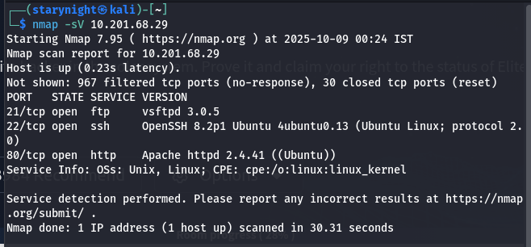
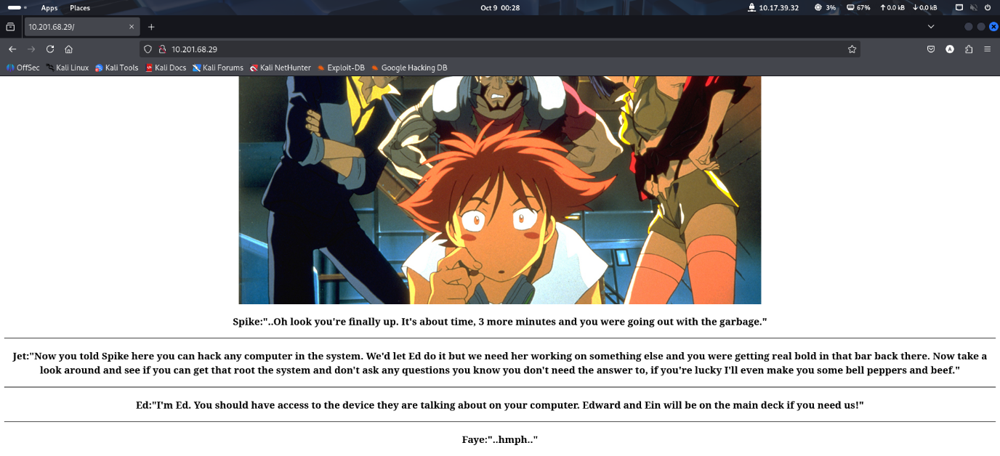
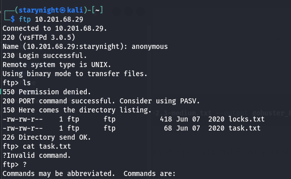
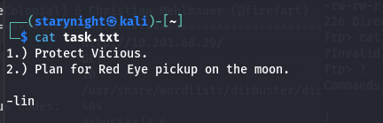
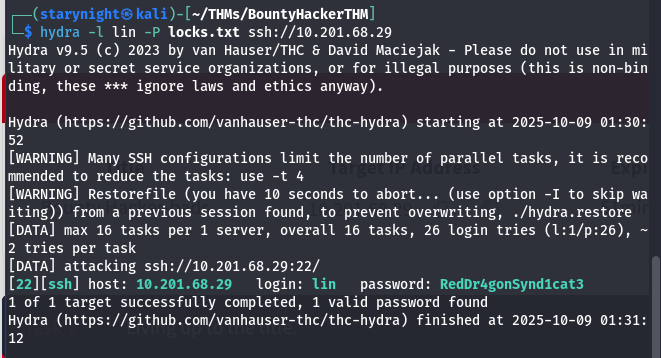
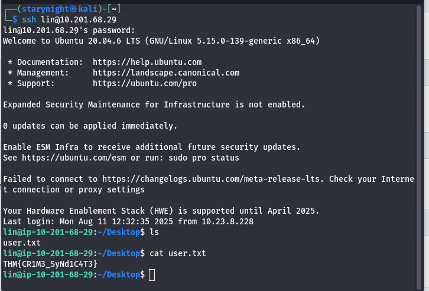
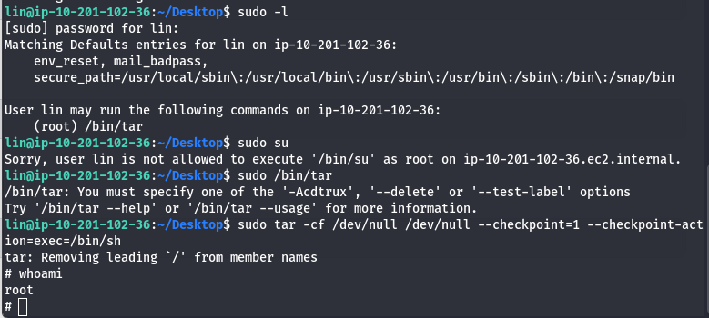
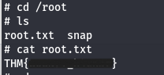

# Bounty Hacker-TryHackMe Writeup
This write-up covers my step-by-step approach to solving the Bounty Hacker room on TryHackMe. Using tools like Nmap, Gobuster, Hydra, and GTFOBins techniques, I enumerate the machine, uncover credentials through FTP, brute-force SSH access, and escalate privileges using allowed sudo commands.
Tools Used:<br> <br>
•	Nmap<br>
•	Gobuster<br>
•	Hydra<br>
•	GTFOBins techniques<br><br>
Starting with an nmap scan:<br><br>
<br><br>
Since it has port 80 open and is running on apache server, it must be a website. So I pasted the IP address and it opened up this:<br><br>
<br><br>
I want to check if there are any hidden website I can access. I am going to use gobuster:<br>
```gobuster dir --url http://10.201.68.29/ --wordlist /usr/share/wordlists/dirbuster/directory-list-2.3-medium.txt --output gobuster_80.txt```<br><br>
Here’s what I found:<br>
**/image** just had the crew image and a parent directory which obviously led to the main page again.<br>
**/javascript** was forbidden. I’ll need root privileges<br>
Gobuster was taking too long and it did not find anything else. I got impatient and explored ftp port.<br><br>
I logged into ftp using the cmd:<br>
	```ftp 10.201.68.29```<br><br>
<br><br>
I googled how to open the task.txt file. Apparently, you need to download it using the get cmd:<br>
	```get task.txt```<br><br>
And it gets downloaded in the local default directory.<br>
This was the content in the task.txt file:<br><br>
<br><br>
So lin must be the username for ssh. I can try exploring that. Well, I need a password for that.<br>
Wait, the question given on tryhackme said “What service can you bruteforce with the text file found?” and its answer is ssh. Since the word bruteforce is mentioned, does it mean we can use hydra? Well, let’s try that.<br><br>
	```hydra -l lin -P /usr/share/wordlists/rockyou.txt ssh://10.201.68.29```<br>
(https://datascientest.com/en/everything-about-brute-force-attack)<br><br>
It’s taking thousands of hours with this. Let me try something else. <br><br>
Wait, there was something else too besides tasks.txt right? Yes it was locks.txt. Let me get and check that.<br>
Oh that’s a wordlist! I can try that now.<br><br>
<br><br>
Yay! Got the password. I can use this to get into ssh now.<br><br>
<br><br>
Checked all the folders. Nothing there. So need to escalate privileges now.<br>
	```sudo -l``` <br>
To check what lin can access to. They can access /bin/tar when they are root. So seached up and found this:<br><br>

(https://gtfobins.github.io/gtfobins/tar/)<br><br>
<br><br>
Got the root!<br><br>

