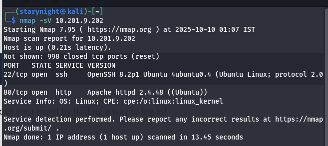
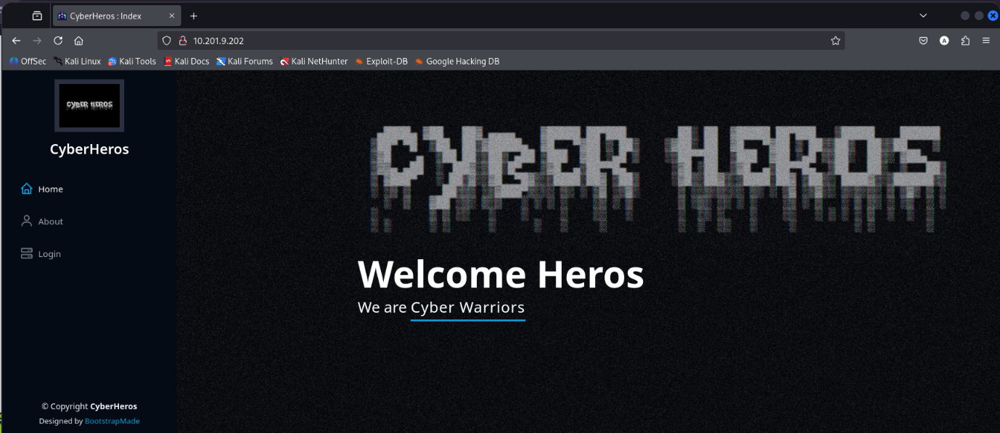
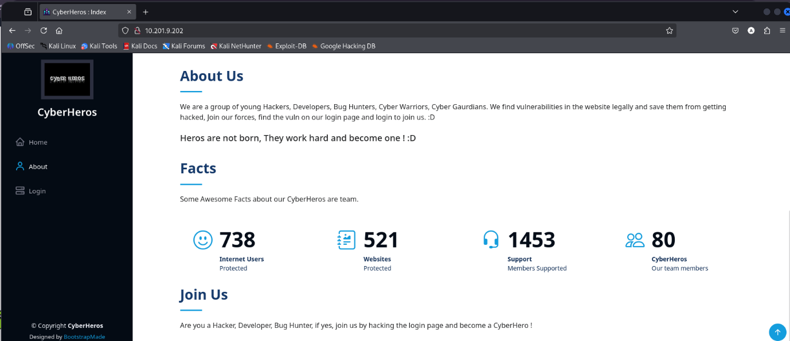
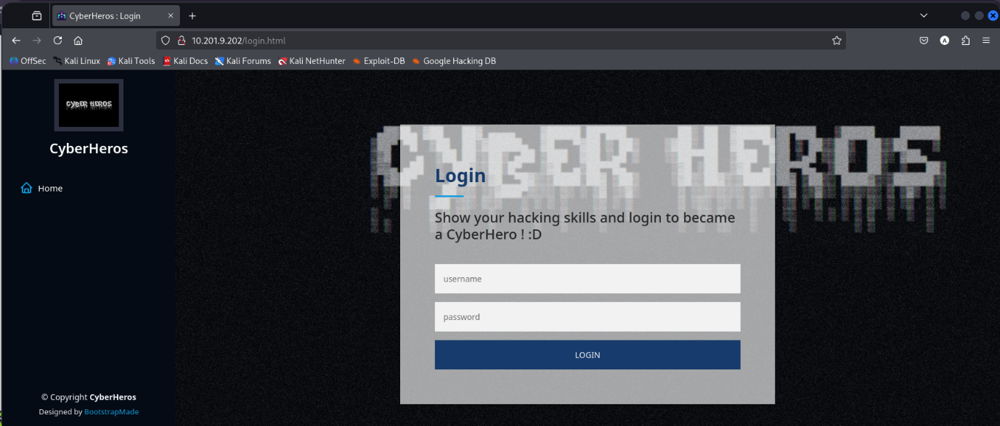
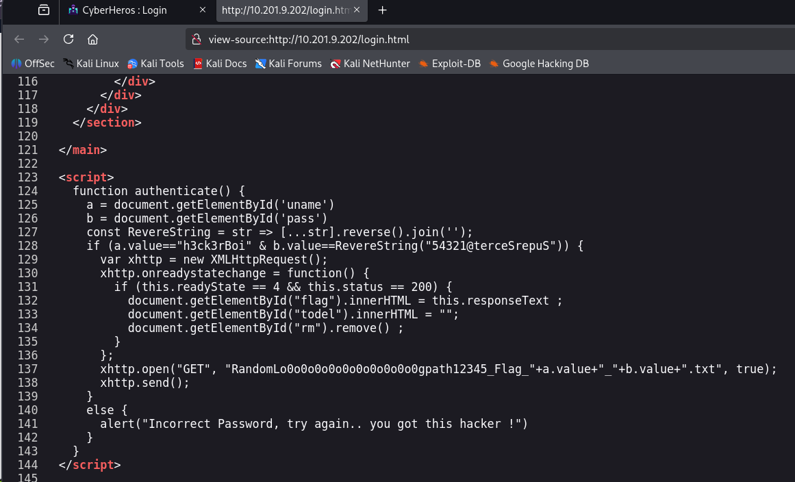
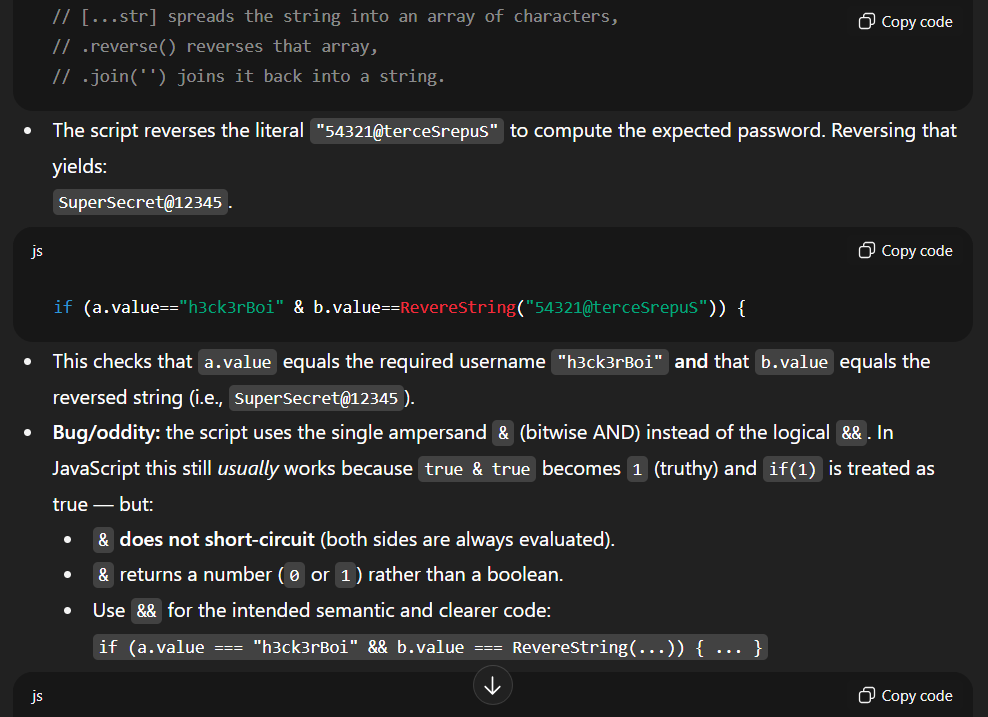
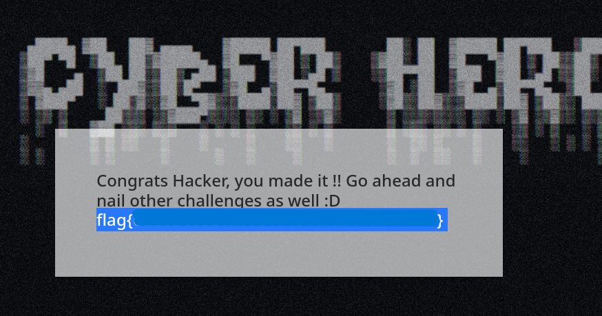

<h1>CyberHeroes – TryHackMe</h1>

A fun beginner-friendly TryHackMe room where we start with some basic enumeration, try a little brute-forcing, inspect the page source, and eventually uncover the login credentials to capture the flag. Just a nice reminder that sometimes the simplest clues are hiding in plain sight.  
Tools Used: 
<ul>
  <li>Nmap</li>
  <li>Hydra</li>
</ul>
Starting with an nmap scan as usual:   

Two ports open, ssh and http.  
Let’s paste the ip address in firefox and see what’s open:   

 
Cool page right? 
Let’s see what’s in login page:   
 
It has a login form page in html. I can use hydra to bruteforce into it. But before that, let me check for any hidden directories. Couldn’t find any.  
Let’s bruteforce now:  
<code>hydra -L /usr/share/wordlists/rockyou.txt -P /usr/share/wordlists/rockyou.txt  -vV 127.0.0.1 http-post-form "/admin/login.php:username=^USER^&password=^PASS^:F=Incorrect Password, try again" -t 12 -f</code>  
It did not show any results. Let’s try another way.  
Souce page might have some important information. Let’s take a look at it:   
 
Uhhh I can’t really understand but I know that I got the username and password. I think the password is just written in reverse but let me check with chatgpt.  
 
Haha! Gotcha! 
Username: h3ck3rBoi  
Password: SuperSecret@12345 
Do not copy paste. It doesn’t accept sometimes. I typed it and got the flag!   
 
