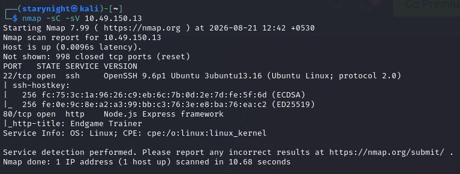
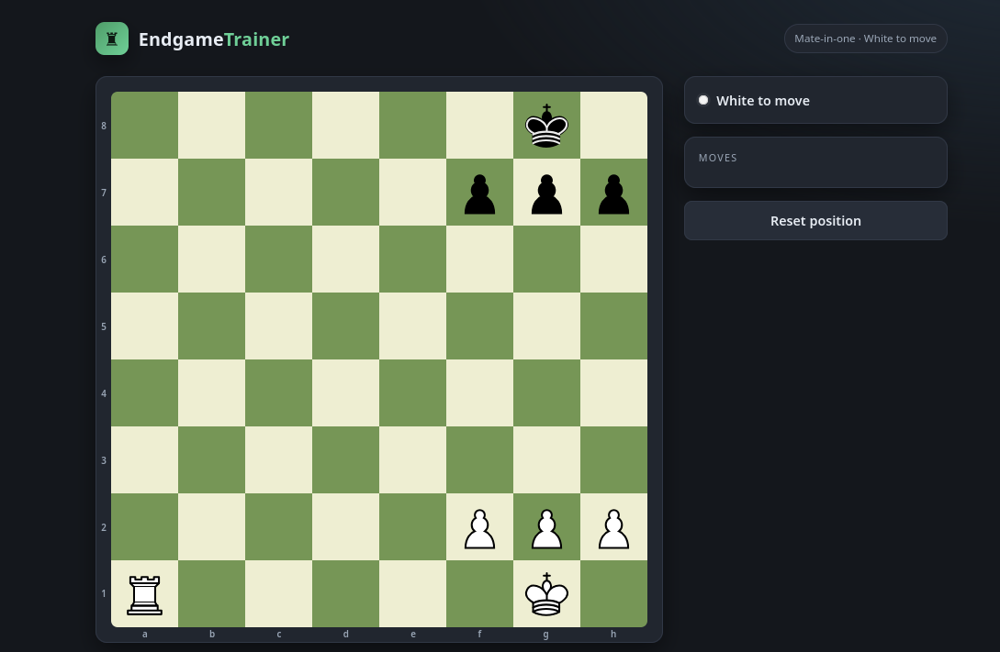
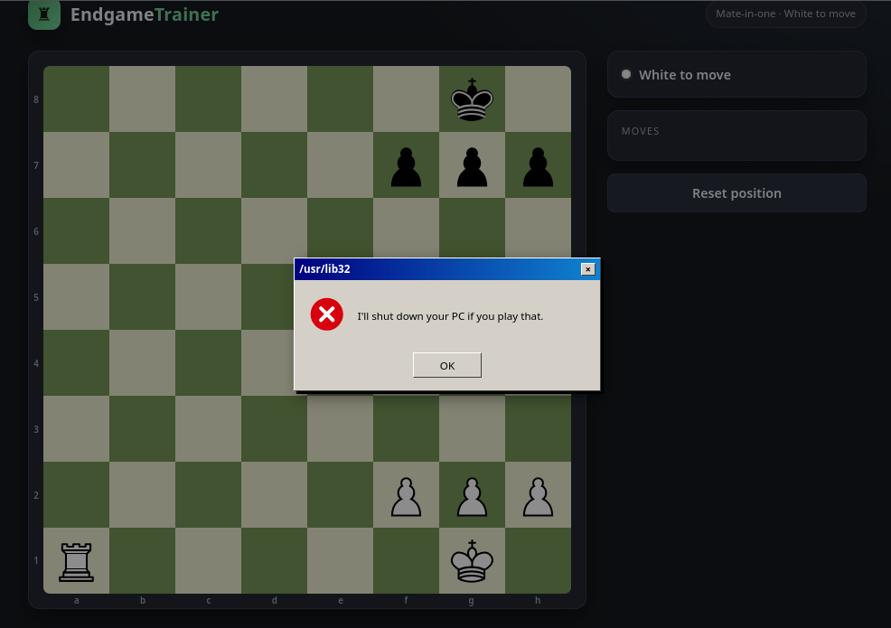
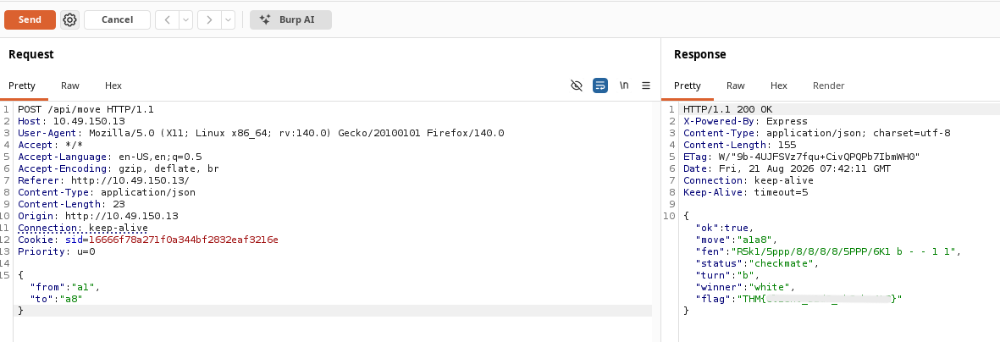

# Fool's Mate - TryHackMe Writeup
This writeup covers my process of finding the vulnerability in a chess training platform.  
Tools Used: 
•	Nmap 
•	Burp Suite  

Starting with an nmap scan:  
<code>nmap -sC -sV 10.49.150.13</code>  
  
The website is a chess platform which is supposed to train the users to play chess.  
  
This is a mate in one, but if I move my rook to a8, it won’t accept its defeat!  
  
Hilarious! I intercepted this request on burp suite but it could not capture it. So I played some other move with the rook, sent it to the repeater and changed the request to a8.  
  
Got the flag! 
This challenge was a very short one and I enjoyed it.
