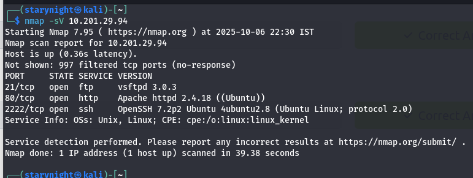
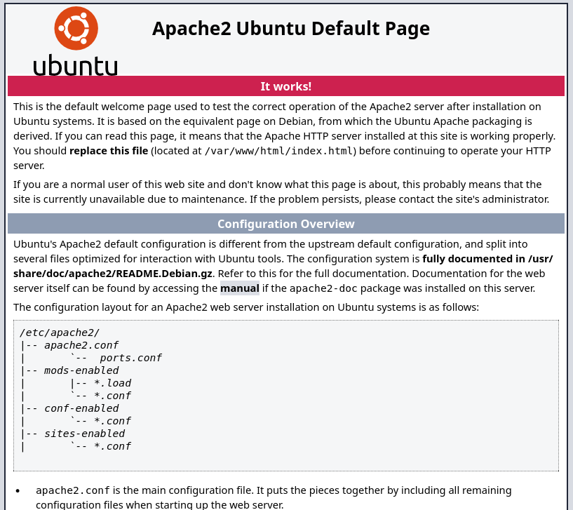
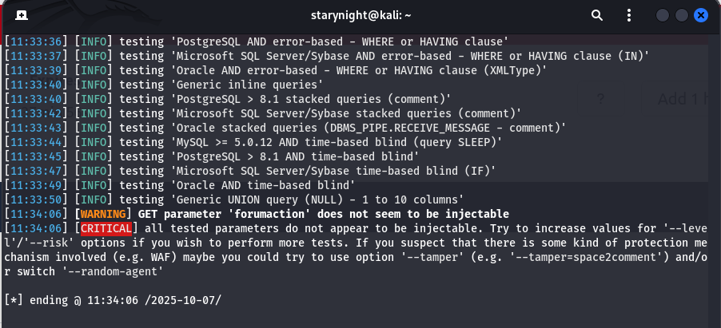
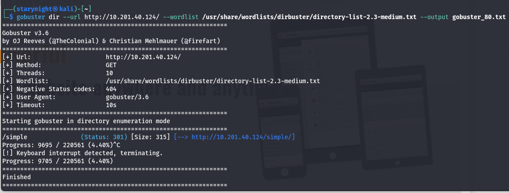
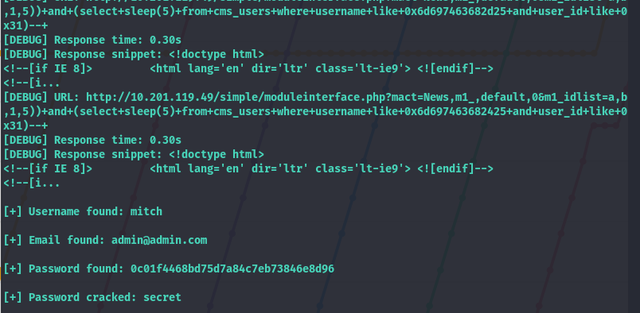
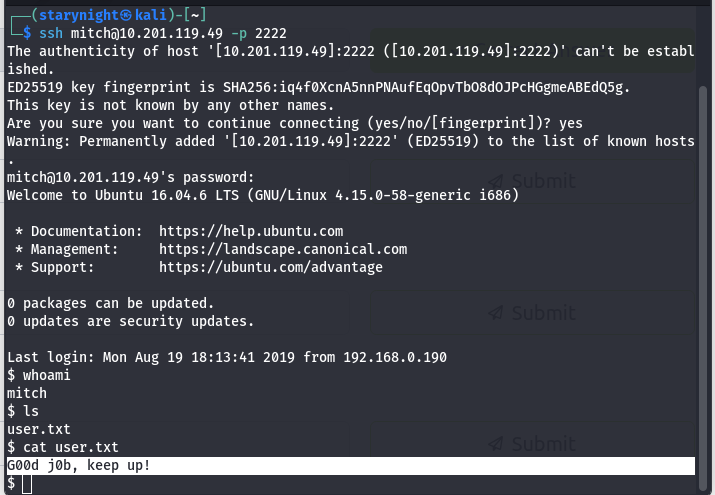
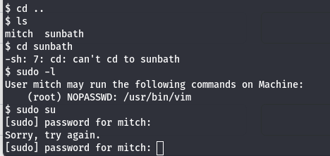
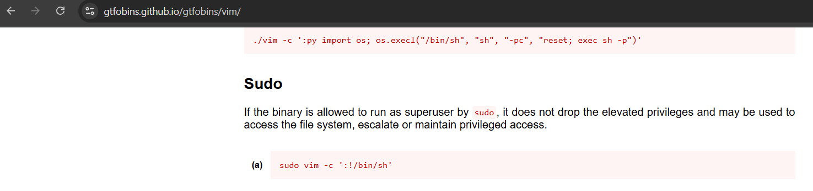
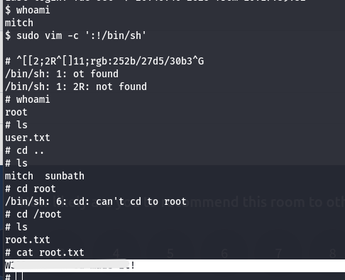

<h1>Simple-CTF-THM-Writeup</h1>
This repository is a complete walkthrough of the Simple CTF challenge on TryHackMe, featuring Nmap scanning, directory enumeration with Gobuster, exploitation of CVE-2019-9053, SSH access, and privilege escalation via sudo permissions.  
  
Tools Used: 
•	Nmap 
•	Gobuster 
•	SQLmap (failed attempt)  
I started with a nmap scan and found 3 open ports:  
  
Q: How many services are running under port 1000? 
A: 2 (ftp and http)  
The highest port number has ssh open. 
Q: What is running on the higher port? 
A: ssh   
Q: What's the CVE you're using against the application? 
This was confusing because there were multiple possible vulnerabilities associated with the services running on the machine. The system was running OpenSSH and Apache (httpd), so my first approach was to explore known vulnerabilities related to OpenSSH. However, none of the commonly referenced CVEs matched the expected answer. 
So I took the hint and it said it was discovered in “CMS Made Simple 2.2.8”, which led me to research its known exploits. This version of CMS Made Simple is affected by a critical vulnerability identified as: 
A: CVE-2019-9053  
This clarified the exploit path. The target application exposed through the web server was vulnerable to SQL Injection, enabling attackers to retrieve sensitive information through crafted requests. 
Upon visiting the IP address in a browser, I was initially met with a default Apache page, which masked the presence of the CMS backend.  
  
While searching for what to do next, I landed on the sqlmap tools documentation where they have given the examples of the attack. 
https://www.kali.org/tools/sqlmap/ 
I performed the first attack thing given which finds what’s in the database apparently. I tried it but it said my sqlmap is outdated so I upgraded it.  
<code>sqlmap -u "http://10.201.61.220/?p=1&forumaction=search" –dbs</code>  
  
Did not really work.  
“Furthermore, compared to 2022, in 2023, SQL injection vulnerabilities were identified as CVEs 2159 times. And in the latest OWASP Top 10, which lists the most critical and common vulnerabilities in web applications, they rank third.”  
(https://www.vaadata.com/blog/sqlmap-the-tool-for-detecting-and-exploiting-sql-injections/)  
After a lot of trial and error, I learned an important lesson. When you visit an IP address and it shows you a web page, whether it’s just one page or several, it’s always worth checking for any hidden or additional pages. These extra directories can hold important clues that aren’t visible at first glance, and they often guide you toward the real entry points of the application.
And to do so, you need to use gobuster, a tool used to check for hidden directories in a web page.   
<code>gobuster dir --url http://10.201.40.124/ --wordlist /usr/share/wordlists/dirbuster/directory-list-2.3-medium.txt --output gobuster_80.txt</code>  
Gobuster found something: /simple and this site has a search bar!  
  
I found this github repo where there’s a <code>CVE 2019-9053 </code> exploit. So I downloaded in on my machine and ran it using this cmd: 
<code>Python exploit.py -u http://10.201.40.124/simple --crack -w /usr/share/wordlists/rockyou.txt</code>  
  
Got the password!  
Now I got all the credentials. Remember ssh was open? So let’s enter there. 
Format : ssh username@ip 
<code>ssh mitch@10.201.40.124</code>  
  
Found another user other than mitch, sunbath. Now we need to escalate our privileges. 
For that, we need to know what thing mitch can do rn. To check that: 
<code>sudo -l</code>  
  
So we can access vim without password. So let’s search how.  
  
(https://gtfobins.github.io/gtfobins/vim/)  
Became root!  
 
Hooray! I did it!
