<h1>Twomillion-Writeup-HTB</h1>
This write-up covers my full exploitation of the 2million HTB machine, starting from basic enumeration and digging through obfuscated JavaScript, to exploiting a flawed API with Burp Suite for admin access. From there, I move into command injection, credential discovery via .env, SSH access, and finally rooting the box using an OverlayFS vulnerability. It’s a quick but detailed walkthrough of the exact steps and thinking that led to the compromise.<br><br>
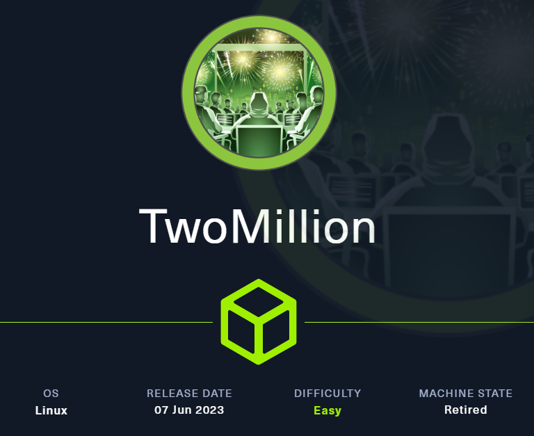<br><br>
Tools Used:<br>
•	Nmap<br>
•	BurpSuite<br><br>

I started with a NMAP Scan to detect any open ports:<br><br>
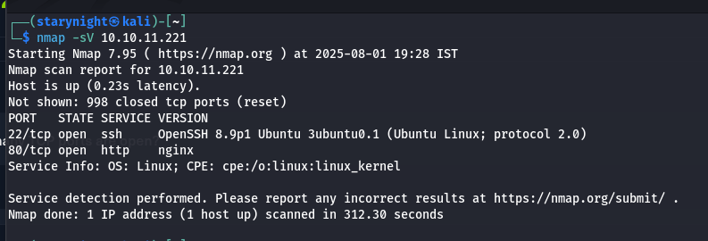<br><br>

The page wouldn’t load. A quick DNS resolution solved it:<br>
```echo”10.10.11.221 2million.htb” | sudo tee -a /etc/hosts```<br>
Once the page opened, I examined the site and found a suspicious link.<br><br>
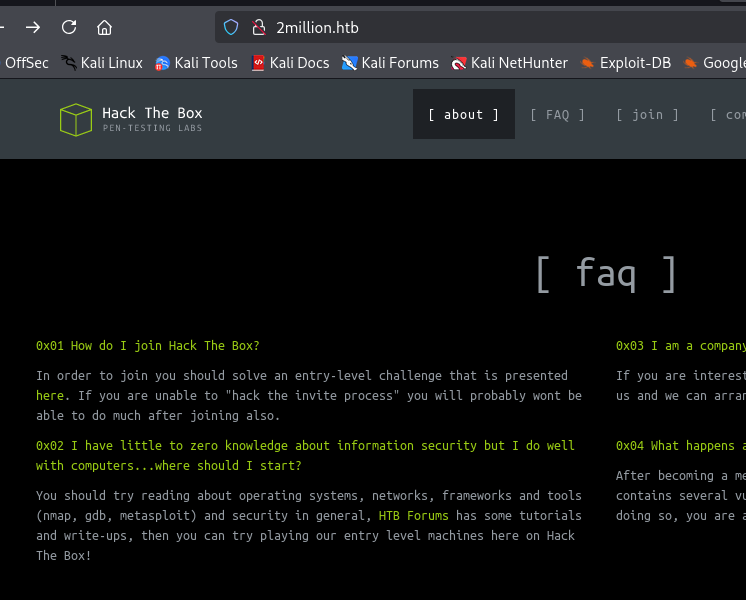<br><br>

2million.htb/invite:<br><br>
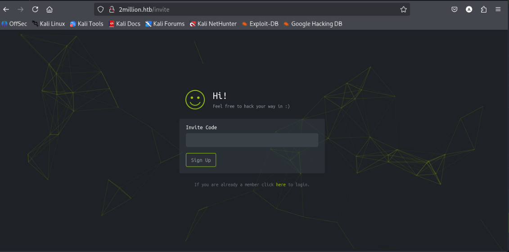<br><br>

Checking the source code, something interesting popped up inside a JavaScript file:<br><br>
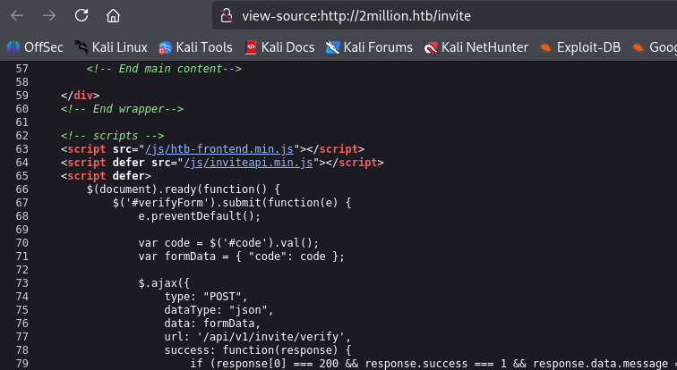<br><br>

The script looked obfuscated, one giant unreadable line. So I grabbed it from ```js/inviteapi.min.js```.I copied the code into ChatGPT and asked for a deobfuscated version, which thankfully came back clean enough to understand.<br><br>
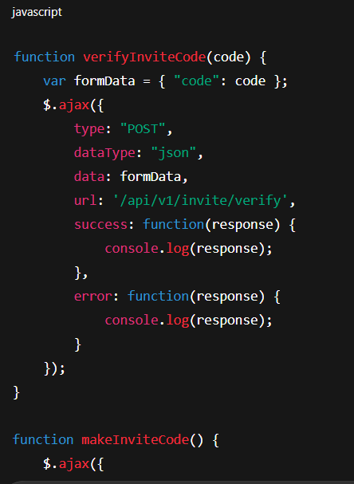<br><br>
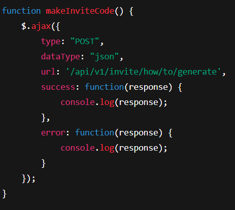<br><br>

I executed a curl command to get this into my machine:<br><br>
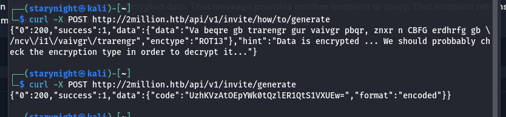<br><br>

Then, I decrypted the code using base64 command:<br>
	```echo ‘UzhKVzAtOEpYWk0tQzlER1QtS1VXUEw=’ | base64 -d```<br><br>
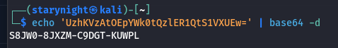<br><br>

I pasted the decoded part into the invite page, logged in using fake credentials, and landed on the home page. After exploring the site, I eventually found an “Access” page where VPN keys were generated.<br><br>
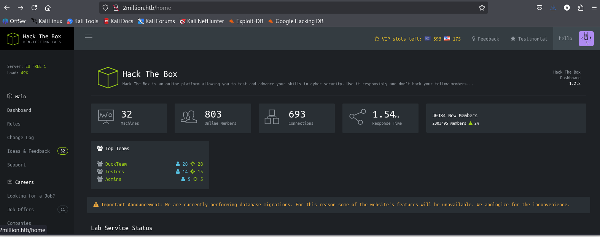<br><br>
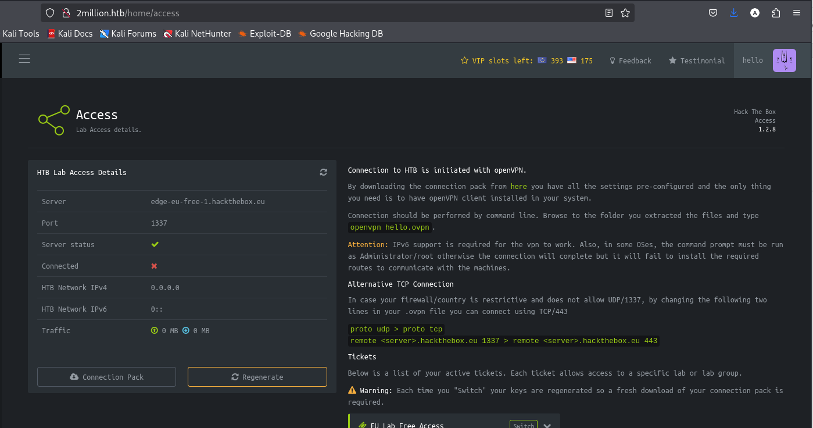<br><br>

Time to bring in Burp Suite!<br>
I intercepted the request responsible for generating the VPN, and after poking around with repeater, I noticed something big:<br><br>
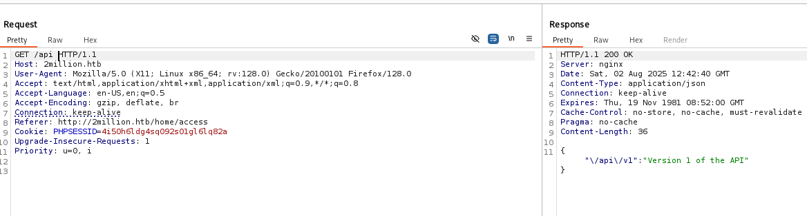<br><br>

So, I modified the address to v1 (version 1):<br><br>
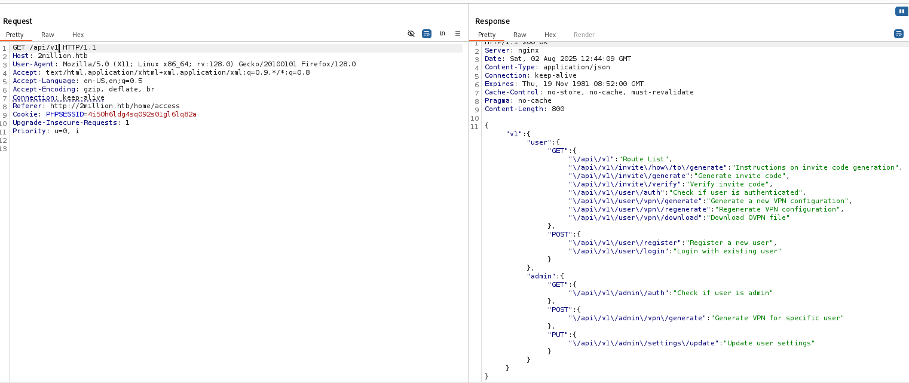<br><br>
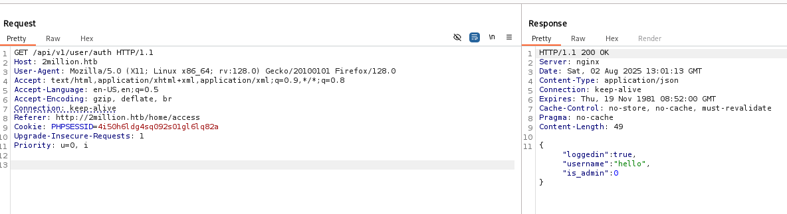<br><br>

I just need to change “is_admin”: 1 and I can enter as admin.<br>
I’ll try getting in as an admin using the PUT method I got:<br><br>
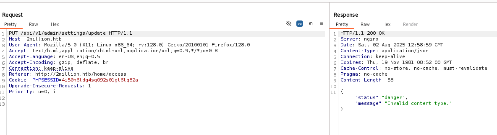<br><br>
“Invalid content type”. Alright, so the issue was not the field but the format.<br><br>

Before modifying the request, I needed to figure out the correct Content-Type header it expected. In Burp Suite, I right-clicked on the request and selected “Change request method.” Doing this twice switched it over to a POST request, which conveniently revealed the Content-Type header that wasn’t visible earlier.<br>
Now, since the response shows the Content-Type as application/json, I need to match that on the request side as well. After updating the header, switch the request method back to PUT, because the server won’t accept the admin change when using POST.<br><br>
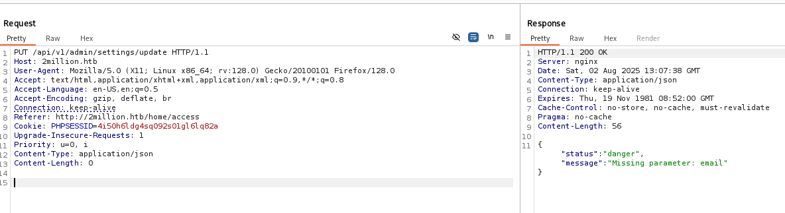<br><br>

“missing parameter: email”, So I’ll add the parameter and the ‘is_admin:’ 1 too:<br><br>
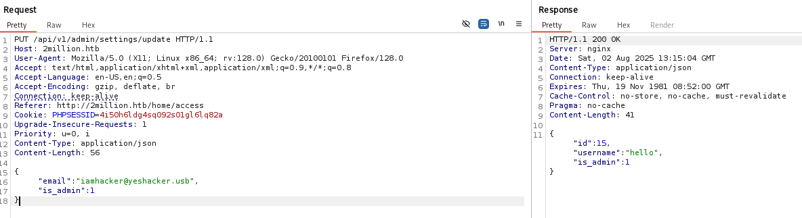<br><br>

Got the admin id! Now that I had admin privileges, I intercepted another VPN-related request, sent it to repeater, and verified the authentication: <br><br>
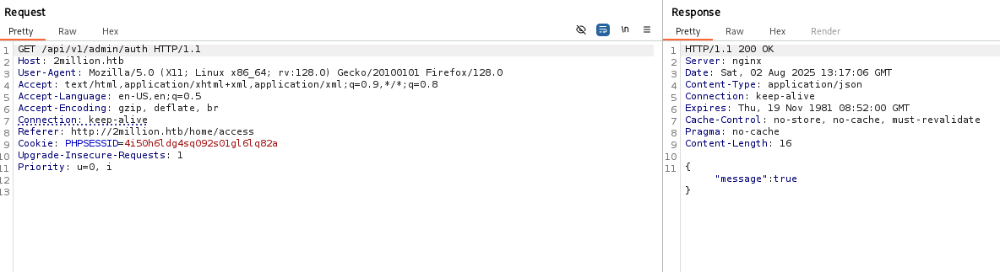<br><br>

Authenticated as admin! Now let’s check other methods of admin. The one left is generate vpn. Let’s try this:<br><br>
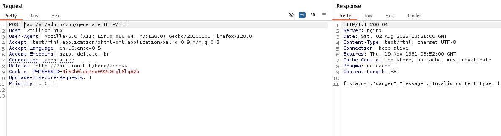<br><br>

Let’s change that:<br><br>
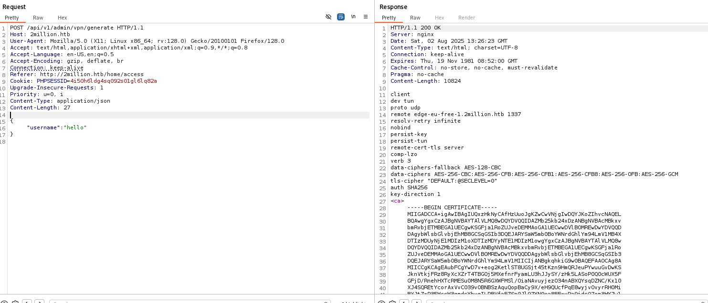<br><br>

Didn’t return anything useful. So, let’s try command injection. Since we already had an ID parameter, I replaced it with something like:<br><br>
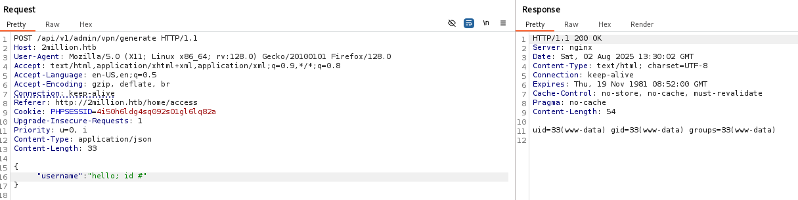<br><br>
Yup it worked!<br>
I now had command execution on the machine. <br>
**ls** shows the list of files here.<br>
**Ls -la** contained .env file so let’s check that out:<br><br>
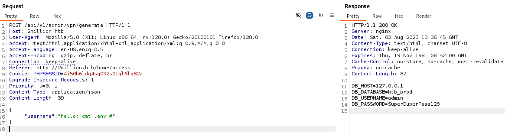<br><br>
I found a credential sitting there in plain text.<br>
Now we can do ssh and get into the machine as admin:<br><br>
	```ssh admin@2million.htb``` or ```ssh admin@10.10.11.221```<br>
Password: **SuperDuperPass123**<br><br>

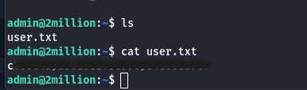<br><br>
LET’S GOOO!!!<br>
I tried running linpeas, but the machine didn’t support it. So let’s try another way:<br><br>
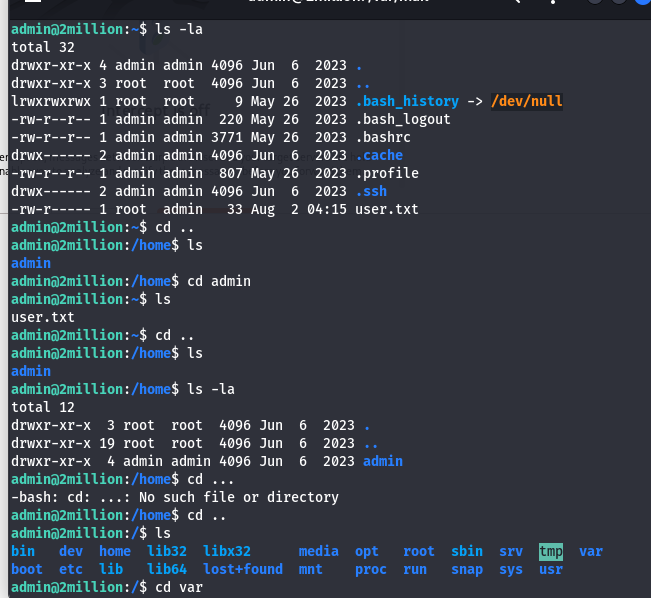<br><br>
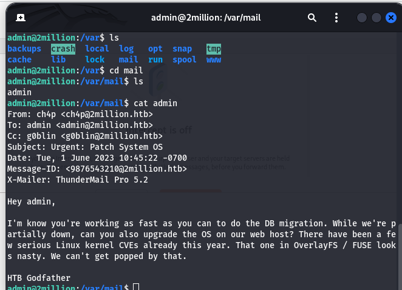<br><br>
According to the mail, it got something to do with overlay-cve. A quick search brought me to a GitHub PoC:<br>
*https://github.com/DataDog/security-labs-pocs/blob/main/proof-of-concept-exploits/overlayfs-cve-2023-0386/poc.c*<br>
copied that and saved it as poc.c<br><br>
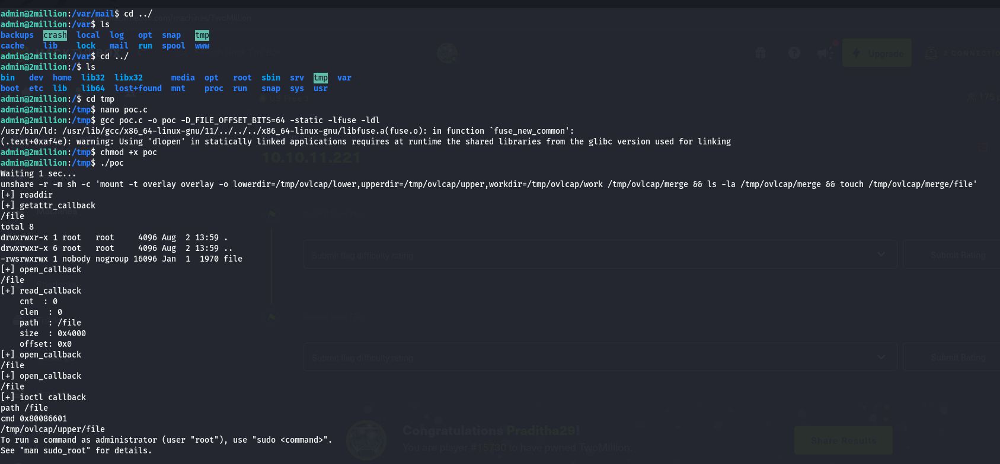<br><br>
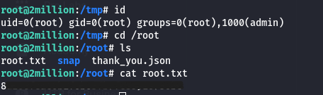<br><br>
So this was 2million!
